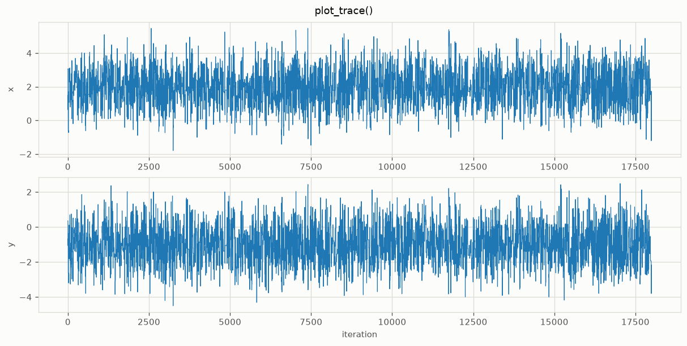
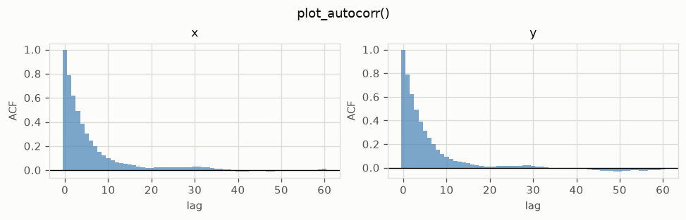
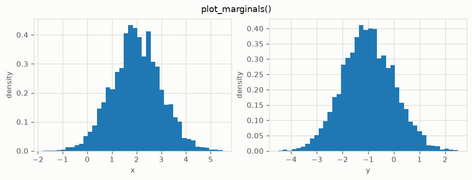
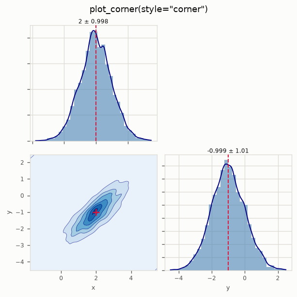
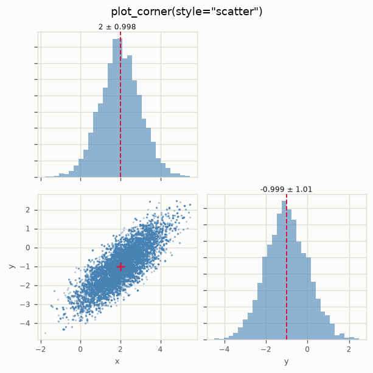
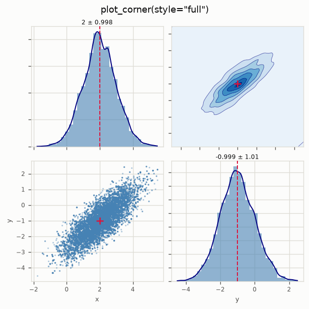
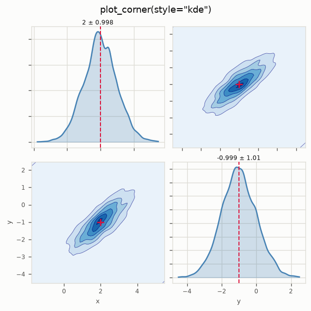
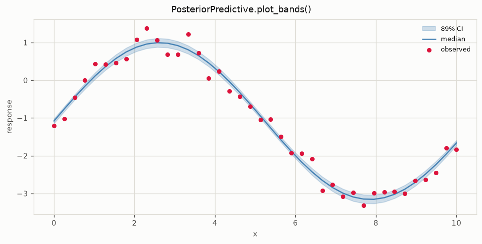
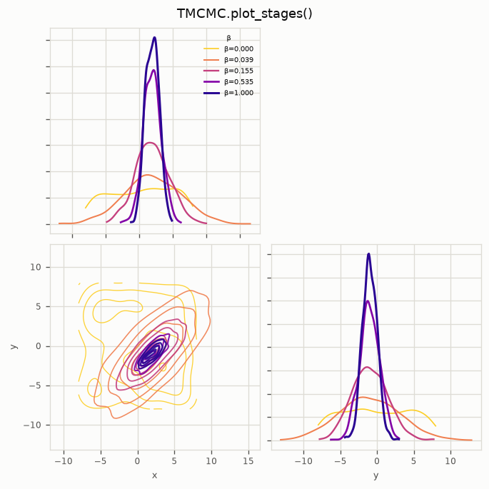

# Plots

Every plot below comes from the package. They need matplotlib, which is an
optional dependency:

```bash
pip install mcmckit[plot]
```

If you drove the loop yourself and have a plain array, wrap it first. All of
these are methods on `Result`:

```python
from mcmckit import Result

result = Result(samples=chain, param_names=["k1", "k2"])
```

---

## Diagnosing the chain

### `plot_trace()`

The first thing to look at, always. One panel per parameter, showing the chain
against iteration. You are checking that it settled somewhere and then wandered
around that place, rather than drifting or sticking.

```python
result.plot_trace(title="My chain")
```



A healthy trace looks like a fuzzy horizontal band. A visible trend means you
have not discarded enough burn-in. Long flat stretches mean proposals are being
rejected repeatedly and your step size is too large.

### `plot_autocorr()`

How quickly the chain forgets where it was. Correlation should decay to zero;
how fast tells you how many iterations one independent sample costs.

```python
result.plot_autocorr(max_lag=60)
```



Slow decay means a low effective sample size. Pair it with `result.ess()` for
the number.

---

## Looking at the posterior

### `plot_marginals()`

One histogram per parameter. The quickest read on where each parameter ended up
and how uncertain it is.

```python
result.plot_marginals(bins=40)
```



### `plot_corner()`

The workhorse. Marginals on the diagonal, pairwise joints off it, so you see
both the individual uncertainties and the **correlations between parameters**.
Those correlations matter in model updating: they are what tells you two
parameters are trading off and cannot be identified separately.

Pass `true_values` in a synthetic study to mark the answer.

```python
result.plot_corner(style="corner", true_values=[2.0, -1.0])
```

Four styles, same data:

=== "corner"

    Histogram and KDE on the diagonal, 2-D KDE contours below. The default,
    and the best general choice.

    

=== "scatter"

    Histogram on the diagonal, raw scatter below. Use it when you want to see
    individual draws, including outliers a KDE would smooth away.

    

=== "full"

    Scatter below the diagonal, KDE contours above. Both views at once, for
    when you cannot decide.

    

=== "kde"

    Smooth densities everywhere. The cleanest for a paper figure, and the most
    willing to hide a sparse or lumpy chain, so check a scatter first.

    

Tuning: `bins` for the diagonal histograms, `kde_grid` for contour resolution,
`levels` for the number of contours, plus `scatter_kwargs`, `hist_kwargs` and
`kde_kwargs` passed through to matplotlib.

---

## Predictions and the model

### `posterior_predictive().plot_bands()`

Propagates posterior samples back through your forward model, so you can check
the fit in the space you actually measured, with honest uncertainty.

```python
pred = result.posterior_predictive(forward_model, n_eval=400)
pred.plot_bands(x=frequencies, y_obs=measurements,
                xlabel="frequency [Hz]", ylabel="amplitude")
```



The band is a credible interval, 90% by default via `ci=(0.05, 0.95)`, with the
median as the line. Observed data overlays as points. If the points sit
systematically outside the band, your model is wrong in a way more data will
not fix.

`n_eval` subsamples the chain, which matters when each forward evaluation is a
finite element solve.

### `TMCMC.plot_stages()`

TMCMC's particle population as it is annealed from prior to posterior. Each
panel is one tempering stage, showing the cloud contracting onto the posterior.

```python
tmcmc = mc.TMCMC(n_particles=1000, n_mcmc_steps=3)
tmcmc.run(problem, prior_samples=prior_samples)
tmcmc.plot_stages(max_stages=6)
```



Useful for confirming the schedule is sensible. Stages that barely move mean
the tempering is too cautious; a single huge jump means it is too aggressive
and particles will have degenerated.

---

## Numbers, not pictures

Plots are for judgement; these are for reporting.

```python
result.mean()            # posterior mean, shape (n_params,)
result.std()             # posterior standard deviation
result.cov()             # full covariance, always (n_params, n_params)
result.quantile([0.05, 0.95])     # credible intervals
result.ess()             # effective sample size per parameter
result.autocorr(max_lag=100)
result.acceptance_rate
```

And for several chains:

```python
from mcmckit import gelman_rubin, convergence_summary

gelman_rubin([c1.samples, c2.samples])       # want below 1.01
convergence_summary([c1.samples, c2.samples])
```

---

## Reshaping a result

Both return a new `Result`, so they chain:

```python
result.discard(2000)                  # drop burn-in
result.select(["k1", "k3"])           # keep a subset of parameters
result.discard(2000).select([0, 2]).plot_corner()
```

---

## Regenerating these figures

Every image on this page is produced by a script in the repository, so the docs
cannot drift from the code:

```bash
python tools/make_docs_figures.py
```
