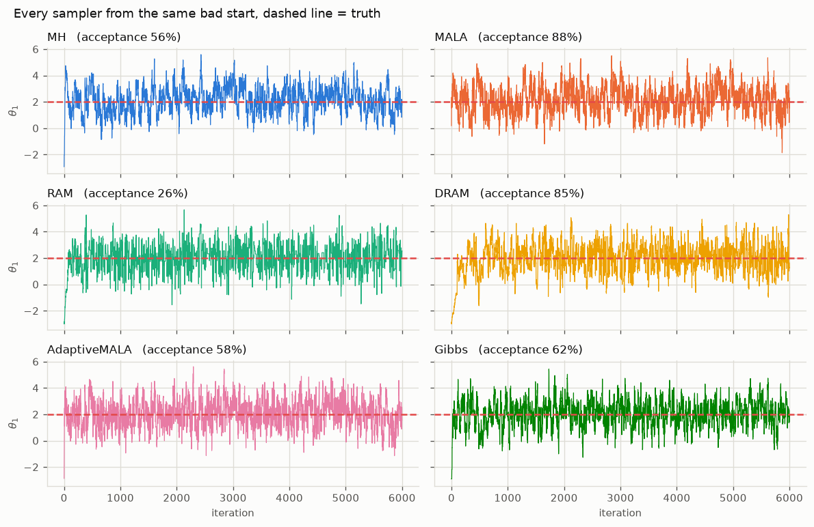
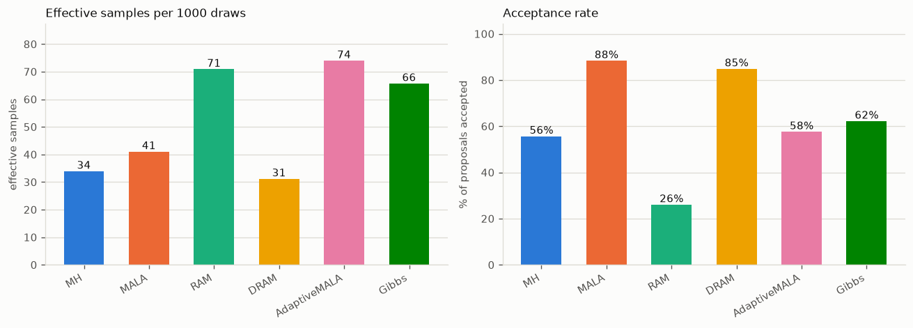
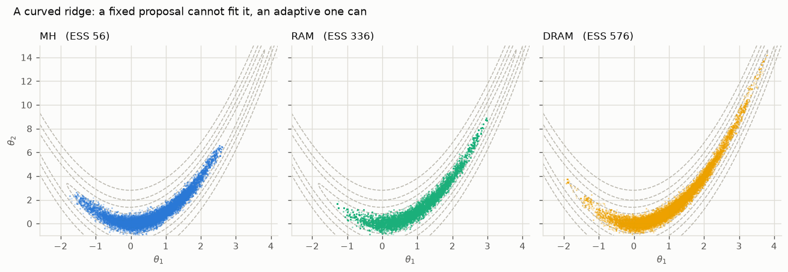
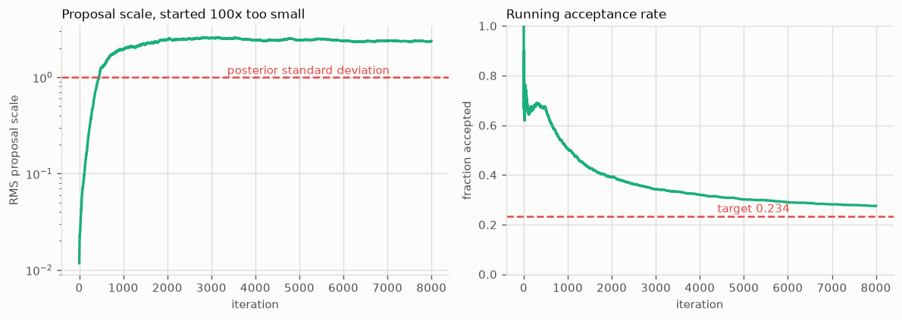

# Choosing a sampler

Seven samplers, one question: which one for your problem. The short answer is
**RAM or DRAM** unless you have gradients, in which case **AdaptiveMALA**. The
rest of this page explains why, and shows what the difference actually looks
like.

For the mathematics behind each algorithm, see [Theory](theory.md). This page
is about choosing and tuning.

---

## The short version

| Sampler | Use it when | Needs tuning | Gradients |
|---|---|---|---|
| **RAM** | Default choice. Self-tunes from a rough guess. | Almost none | No |
| **DRAM** | Hard geometry, expensive models. Best exploration. | Almost none | No |
| **AdaptiveMALA** | You can compute gradients. Fastest mixing. | Almost none | Yes |
| **MALA** | Gradients available and you want a fixed step. | Step size | Yes |
| **MetropolisHastings** | You already know a good proposal covariance. | Covariance | No |
| **Gibbs** | Parameters split into weakly coupled blocks. | Per-block width | No |
| **TMCMC** | Multimodal posteriors, or you need the evidence. | Particle count | No |

Every one is available both as a [step function](api/steps.md) you drive
yourself and as a [full-run helper](api/runners.md).

---

## What the differences look like

All six chain samplers, started from the same deliberately bad point on a
correlated 2-D Gaussian. Dashed line is the truth.



On an easy target they all work. Every chain finds the mode within a few
hundred steps and stays there. If your posterior looks like this, the choice
barely matters.

What differs is how *efficiently* they explore. Effective sample size counts
how many independent draws your correlated chain is actually worth:



Two things in that figure are worth pausing on.

**A high acceptance rate is not a good sign.** MALA accepts 88% of proposals
and DRAM 85%, yet DRAM yields the *fewest* effective samples of any sampler
here. Accepting almost everything means the steps are too small: the chain
crawls, and consecutive draws are nearly identical. RAM accepts only 26% and
produces more than twice DRAM's effective samples. Chasing acceptance rate is
the most common tuning mistake.

**DRAM's acceptance rate is inflated by construction.** It counts both stages,
and the second stage proposes at `dr_scale**2` times the covariance, a much
smaller step that is accepted most of the time. Compare DRAM's number against
other samplers with that in mind. It is not measuring the same thing.

---

## Where adaptation earns its keep

The easy target flatters everyone. Give the samplers a curved ridge, where no
single fixed proposal shape fits the geometry anywhere, and they separate
sharply:



Same 20,000 iterations, same starting point. Metropolis-Hastings with a fixed
proposal is stuck in the low curve of the ridge and never explores the arms.
RAM covers six times more of the distribution, DRAM ten times.

This is the realistic case for model updating. Parameters trade off against
one another, so the posterior is a narrow correlated ridge, and you rarely
know its shape before you have sampled it. That is exactly what an adaptive
sampler works out for you.

---

## The samplers

### RAM — Robust Adaptive Metropolis

**The default.** Learns the proposal covariance as it goes using a rank-1
Cholesky update, targeting a 0.234 acceptance rate. Give it a rough initial
scale and it finds the right one.

```python
from mcmckit import ram_step

S = np.linalg.cholesky(np.eye(d) * 0.1**2)      # a rough guess is fine
for i in range(1, n_iter + 1):
    x, logp, S, accepted = ram_step(log_post, x, logp, S, i)
```

Started 100 times too small, it recovers within roughly 2,000 iterations:



The proposal settles near 2.4 times the posterior standard deviation, close to
the theoretically optimal `2.38/sqrt(d)` scaling for a random walk, and the
acceptance rate converges to its 0.234 target. You did nothing to make that
happen.

One likelihood evaluation per step. `gamma` controls how fast adaptation
decays (default 0.51; lower adapts longer), `target_rate` the acceptance it
aims for.

### DRAM — Delayed Rejection Adaptive Metropolis

**The best explorer, at a price.** Combines adaptive covariance learning with
delayed rejection: when a proposal is rejected, it tries a second, smaller one
instead of standing still. That second chance is what let it cover the ridge
above so much better.

```python
from mcmckit import dram_step, init_dram_state

state = init_dram_state(x0, initial_cov=0.1)
for i in range(n_iter):
    x, logp, state, accepted = dram_step(log_post, x, logp, state)
```

`accepted` is 0, 1 or 2, telling you which stage succeeded, so it stays truthy
on acceptance while remaining informative.

The price is **up to two likelihood evaluations per step**. If your forward
model takes a minute, that matters; if the model is cheap, DRAM is usually the
strongest choice.

### AdaptiveMALA and MALA

**Use gradients if you have them.** MALA biases proposals uphill using the
gradient of the log posterior, which mixes faster than a blind random walk,
especially in higher dimensions. AdaptiveMALA additionally tunes its step size
in log space toward a 0.574 acceptance rate.

```python
from mcmckit import mala_step

logp, grad = log_post_and_grad(x)                # callable returns both
for _ in range(n_iter):
    x, logp, grad, accepted = mala_step(log_post_and_grad, x, logp, grad, 0.4)
```

The gradient is threaded through the loop so it is computed once per accepted
move, never twice. Prefer AdaptiveMALA over MALA unless you specifically want
a fixed step size, since plain MALA is sensitive to that choice.

In model updating, gradients usually mean either an analytic model or
automatic differentiation. If your forward model is a black-box solver, you
almost certainly do not have them, and RAM or DRAM is the answer.

### MetropolisHastings

**The baseline.** A fixed Gaussian proposal, no adaptation. Worth using when
you genuinely know a good covariance, typically from a pilot run:

```python
result = ram(log_post, x0, n_samples=5000)      # pilot
cov = result.discard(1000).cov()                # learned shape
final = metropolis(log_post, x0, 50_000, proposal_cov=cov)
```

That pattern is useful because a fixed proposal makes the chain a genuine
time-homogeneous Markov chain, which some theoretical arguments require.
Otherwise, RAM does this for you.

### Gibbs — Metropolis-within-Gibbs

**For block structure.** Updates parameter groups one at a time, each with its
own proposal width. Useful when parameters live on very different scales, or
when a subset is much cheaper to re-evaluate than the rest.

```python
from mcmckit import gibbs_step

x, logp, accepted = gibbs_step(log_post, x, logp,
                               blocks=[[0, 1], [2]], proposal_std=[0.5, 0.1])
```

`accepted` is one flag per block, so you can tune each width separately. Note
the cost: **one likelihood evaluation per block per sweep**, so a 10-block
problem costs 10 evaluations per iteration.

### TMCMC — Transitional MCMC

**Different in kind.** Rather than one chain walking, TMCMC moves a population
of particles through a sequence of tempered distributions bridging prior to
posterior. That gives it two things the chain samplers cannot offer:

- **Multimodal posteriors.** Particles can populate several modes at once,
  where a single chain typically finds one and stays.
- **The log evidence**, as a by-product, which is what
  [model comparison](examples/model_comparison.md) needs.

```python
tmcmc = mc.TMCMC(n_particles=1000, n_mcmc_steps=3)
result = tmcmc.run(problem, prior_samples=prior_samples)
print(result.log_evidence)
```

Because it advances a whole population per stage rather than a single
position, TMCMC has no single-step form and remains a class. It is also the
sampler that benefits most from
[parallel evaluation](parallel.md), since particles within a stage are
independent.

---

## Practical guidance

**Start with RAM.** It costs one evaluation per step, tunes itself, and is
hard to misuse. Move to DRAM if the posterior geometry is awkward and your
model is cheap enough to afford two evaluations per step.

**Judge with effective sample size, not acceptance rate.** `result.ess()`
reports it per parameter. If ESS is a small fraction of your chain length, the
chain is crawling, whatever the acceptance rate says.

**Check convergence with several chains.** A single chain cannot tell you it
missed a mode. Run a few from dispersed starts and compute the Gelman-Rubin
statistic:

```python
from mcmckit import gelman_rubin, convergence_summary

print(gelman_rubin([c1.samples, c2.samples, c3.samples]))   # want < 1.01
```

**Discard burn-in, and look at the trace before trusting anything.** See
[Plots](plotting.md) for what the package draws for you.
